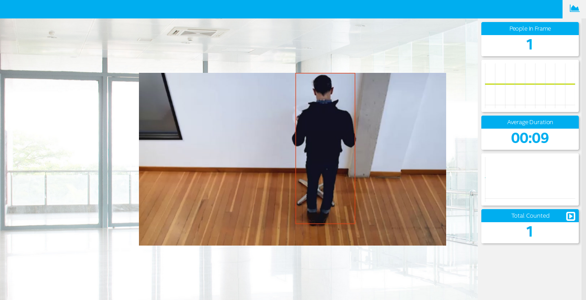

# IoT Reference Implementation: People Counter



## What it Does
This people counter application is one of a series of IoT reference implementations aimed at instructing users on how to develop a working solution for a particular problem. It demonstrates how to create a smart video IoT solution using Intel® hardware and software tools. This people counter solution detects people in a designated area providing number of people in the frame, average duration of people in frame, and total count.

## How it Works

The counter uses the Inference Engine included in the OpenVINO™ and the Intel® Deep Learning Deployment Toolkit. A trained neural network detects people within a designated area by displaying a green bounding box over them. It counts the number of people in the current frame, the duration that a person is in the frame (time elapsed between entering and exiting a frame), and the total number of people seen, and then sends the data to a local web server using the Paho\* MQTT C client libraries.

## Requirements
### Hardware 
* 6th Generation Intel® Core™ processor with Intel® Iris® Pro graphics and Intel® HD Graphics.

### Software
* [Ubuntu\* 16.04 LTS](http://releases.ubuntu.com/16.04/)
*Note*: We recommend using a 4.14+ Linux kernel with this software. Run the following command to determine your kernel version:

```
uname -a
```
* OpenCL™ Runtime Package
* OpenVINO™

## Setup

There are four components that need to be running for this application to work:
* MQTT Mosca server
* Node.js\* Web server
* Ffmpeg server
* Computer vision application (ieservice/obj_recognition)

You must run each in a separate terminal, or using something like tmux.

Before running the MQTT or web server, install the following dependencies:
```
sudo apt update
sudo apt install npm nodejs nodejs-dev nodejs-legacy
sudo apt install libzmq3-dev libkrb5-dev
```

### Install OpenVINO™
Refer to the [installation guide on IDZ](https://software.intel.com/en-us/articles/CVSDK-Install-Linux)
for instructions on how to install and setup OpenVINO™.

You will need the OpenCL™ Runtime Package if you plan to run inference on the GPU as shown by the
instructions below. It is not mandatory for CPU inference. After you install OpenVINO™, you can
return to this guide, as it comes bundled with ready to use model files for the Inference Engine.

### Install Paho\* MQTT C client libraries

```
sudo apt update
sudo apt install libssl-dev
cd ~
git clone https://github.com/eclipse/paho.mqtt.c.git
cd paho.mqtt.c
make
sudo make install
sudo ldconfig
```

## Installation

### MQTT Mosca server
in the ```/webservice/server``` directory, run:

```
npm install
```

### Web server
in the ```/webservice/ui``` directory, run:
```
npm install
```

You should see

``` 
webpack: Compiled successfully.
```
in the terminal.

### Ffmpeg server
This reference implementation uses ffmpeg to compress and stream video output from cvservice to the webservice clients. ffmpeg is installed separately from the Ubuntu repositories:

```
sudo apt update
sudo apt install ffmpeg
```

## Running the application

### Step 1 - start the Mosca server
```
cd people-counter/webservice/server/node-server
node ./server.js
```
You should see the following message, if successful:

```
connected to ./db/data.db
Mosca server started.
```

### Step 2 - Start the GUI

Start another terminal 
```
cd people-counter/webservice/ui
npm run dev
```

### Step 3 - FFMPEG Server

Start yet another terminal for ffmpeg server
```
cd people-counter
sudo ffserver -f ./ffmpeg/server.conf
```

### Step 4 - Build and start the main application that does people counting using deeplearning Inference
This flow uses the SSD derived person detection model bundled with OpenVINO™. Other SSD models can be plugged in with no changes.
To clean re-build, start another terminal, and run the following commands:

```
cd people-counter/ieservice
mkdir build
cd build
source /opt/intel/computer_vision_sdk/bin/setupvars.sh
cmake ..
make
```

The new version of the software will be built as people-counter/ieservice/bin/intel64/Release/obj_recognition. Switch to the directory where the main application was built:

```
cd ../bin/intel64/Release
```

Setup the needed MQTT environment variables:

```
export MQTT_SERVER=localhost:1884
export MQTT_CLIENT_ID=cvservice
```

And then run the program:

```
./obj_recognition -i Pedestrain_Detect_2_1_1.mp4 -m /opt/intel/computer_vision_sdk/deployment_tools/intel_models/person-detection-retail-0012/FP16/person-detection-retail-0012.xml -l /opt/intel/computer_vision_sdk/deployment_tools/intel_models/person-detection-retail-0012/FP16/person-detection-retail-0012.bin -d GPU -t SSD -thresh 0.7 0 2>/dev/null | ffmpeg -v warning -f rawvideo -pixel_format bgr24 -video_size 544x320 -i - http://localhost:8090/fac.ffm
```

Running again from a new terminal requires setting up the MQTT variables and sourcing the setupvars.sh script beforehand. Both FP16 and FP32 network models can be used with GPU inference, however only the FP32 model is available for CPU inference.


### Step 5 - Open Browser (dashboard)

Start a browser http://localhost:8080 and you should see the web based user interface.

